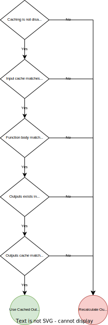

# Kedro Cache

> :warning: _This plugin is still under active developement and not fully tested. Do not use this in any production systems. Please report any issues that you find._

## 📝 Description

`kedro-cache` is a [kedro](https://kedro.org/) plugin that plugin that enables the caching of data sets.
The advantage is that the data sets are loaded from data catalog and not recomputed if they have not changed.
If the input data sets or code have changed, the outputs are recomputed and the data catalog is updated.
This plugin works out of the box with any kedro project without having to change the code.
The logic on how to determine if the cached data set in the catalog should be used is described in the flow chart below.



**Disclaimer:** _The caching strategy determines if a node function has changes by simply looking at the immediate function body.
This does not take into account other things such as called function, global variable etc. that might also have changed._

## 🏆 Features

- Caching of node outputs in catalog
- No change to kedro project needed
- Integration with kedro data catalog
- Configuration via `config.yml` file

## 🏗 Installation

The plugin can be install with `pip`

```bash
pip install kedro-cache
```

## 🚀 Enable Caching

In the root directory of your kedro project, run

```bash
kedro cache init
```

This will create a new file `cache.yml` in the `conf` directory of your kedro project in which you can configure the `kedro-cache` module.
Although this step is optional as the plugin comes with default configurations.

Next let's assume that you have the following kedro pipeline for which you want to add caching.
There are two nodes.
One that reads data from a `input` dataset, does some computations and writes it to a `intermediate` dataset and one that reads the data from the `intermediate` dataset and writes it to the `output` dataset.

```python
# pipeline.py

def register_pipelines() -> Dict[str, Pipeline]:
    default_pipeline = pipeline(
        [
            node(
                func=lambda x: x,
                inputs="input",
                outputs="intermediate",
            ),
            node(
                func=lambda x: x,
                inputs="intermediate",
                outputs="output",
            ),
        ],
    )
    return {"__default__": default_pipeline}
```

In order to add logging we simply just have to register all used data sets in the data catalog.
Because if the first node want to use the cached output instead of recalculating it, it need to load it from the data catalog.
This is only possible if it was stored there.

```yaml
# catalog.yml

input:
  type: pandas.CSVDataSet
  filepath: input.csv

intermediate:
  type: pandas.CSVDataSet
  filepath: intermediate.csv

output:
  type: pandas.CSVDataSet
  filepath: output.csv
```

And that was it. Just by adding all files to the catalog you enabled caching.
